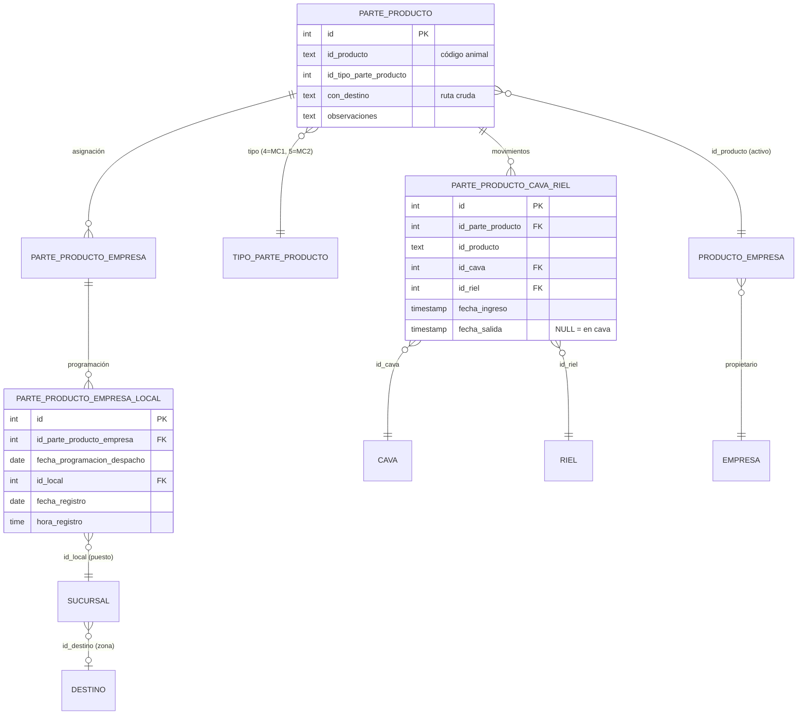
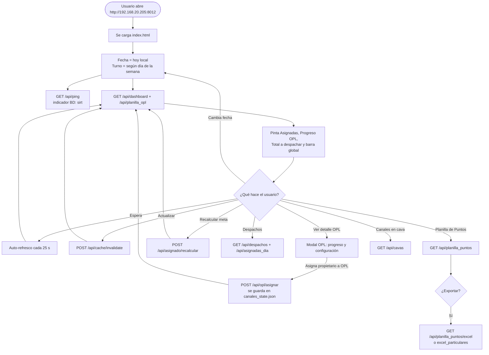
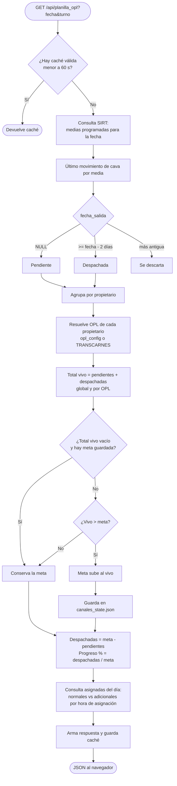
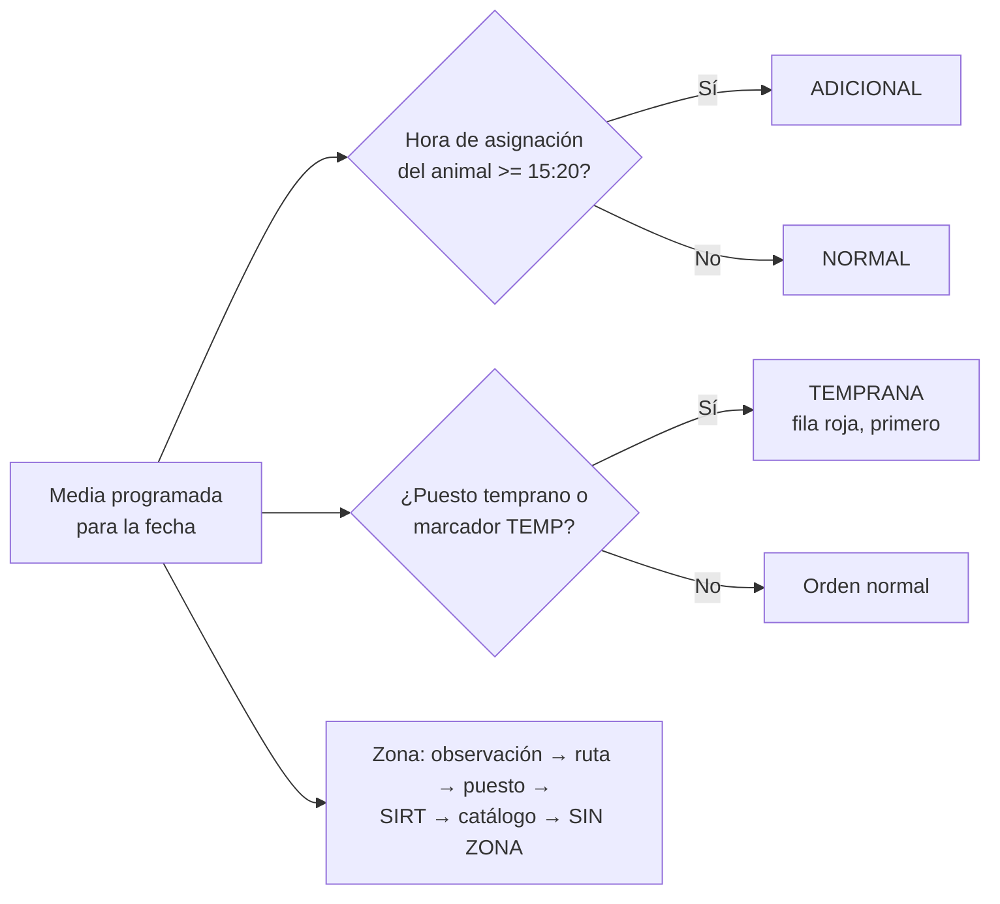
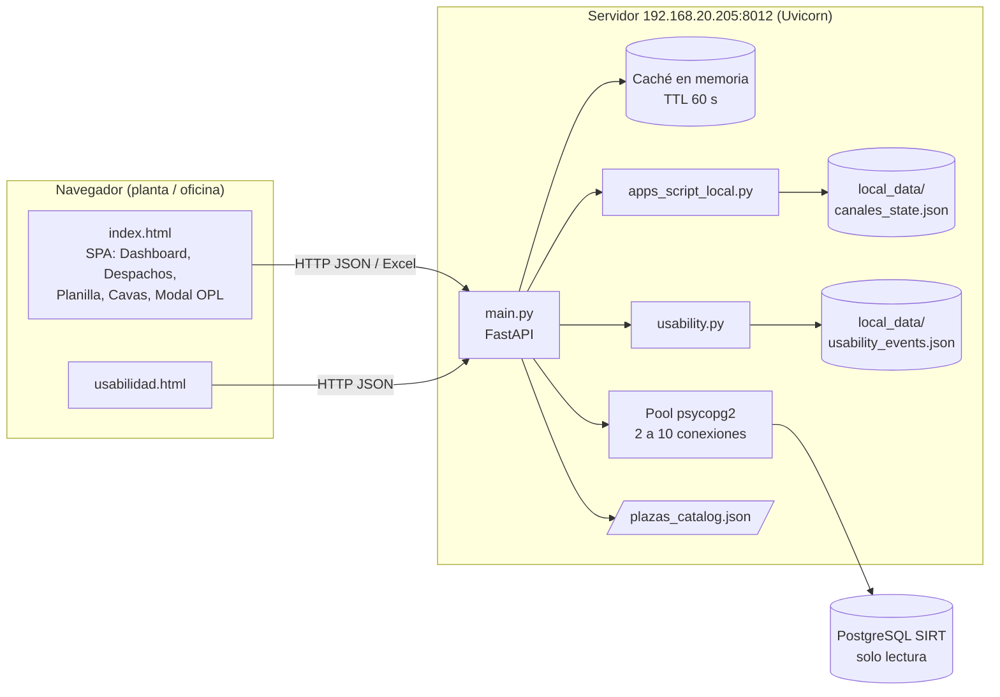
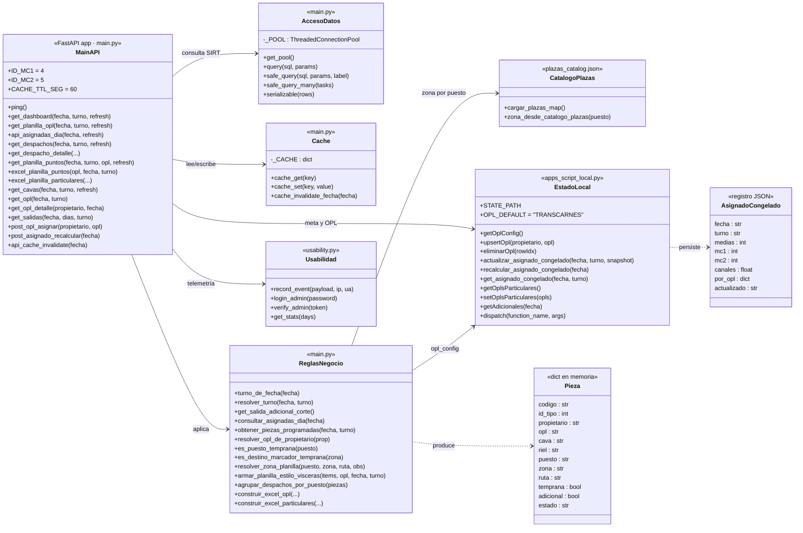
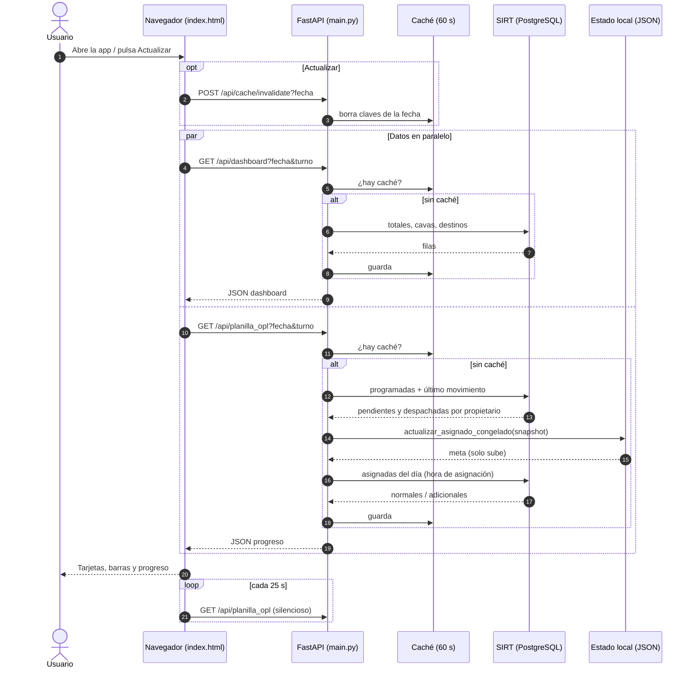
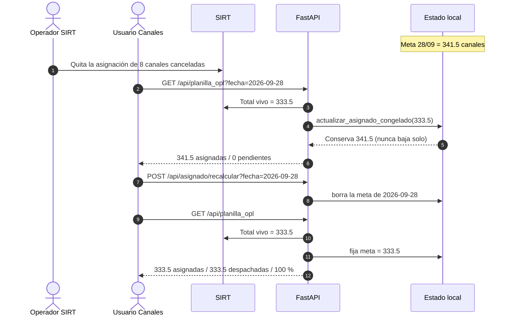
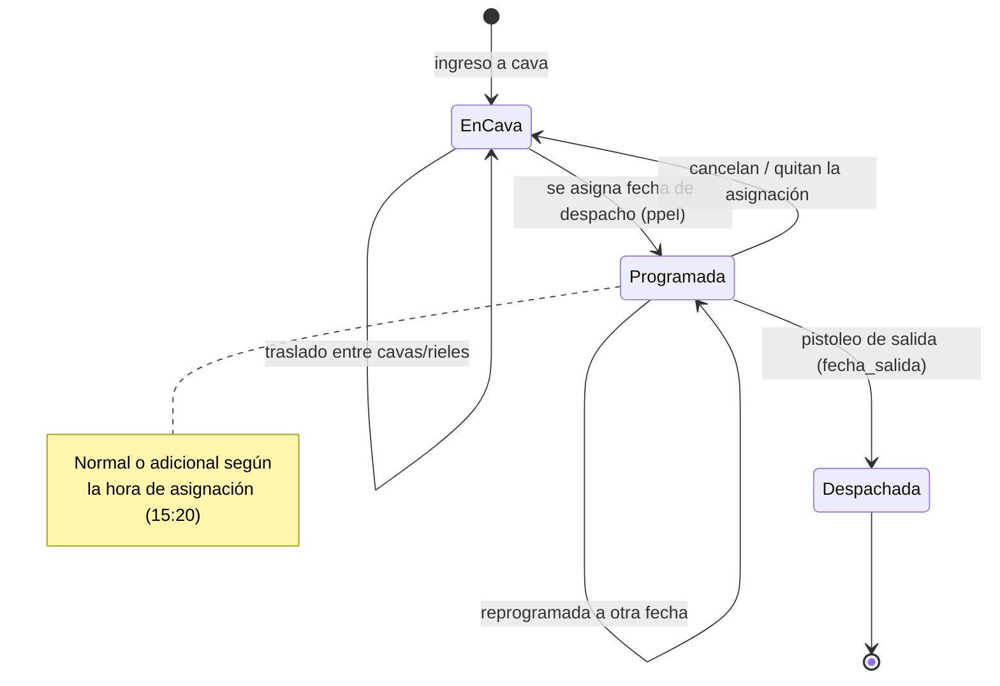
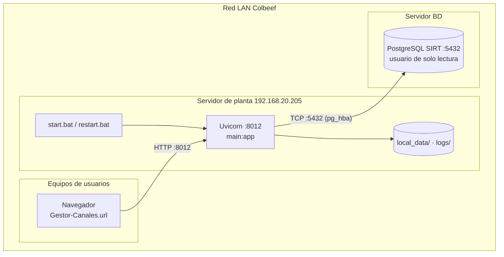

# Despacho de Canales · Colbeef — Documentación técnica y funcional

> Versión del documento: 30/09/2026 · Aplicación v1.0
> Repositorio: `despacho-canales` · Servidor de planta: `http://192.168.20.205:8012`

---

## Índice

1. [Qué es y para qué sirve](#1-qué-es-y-para-qué-sirve)
2. [Arquitectura general](#2-arquitectura-general)
3. [Estructura del proyecto](#3-estructura-del-proyecto)
4. [Instalación, despliegue y operación](#4-instalación-despliegue-y-operación)
5. [Configuración (.env)](#5-configuración-env)
6. [Modelo de datos (SIRT y estado local)](#6-modelo-de-datos)
7. [Reglas de negocio](#7-reglas-de-negocio)
8. [Módulos de la interfaz](#8-módulos-de-la-interfaz)
9. [API REST (endpoints)](#9-api-rest)
10. [Diagrama de flujo](#10-diagrama-de-flujo)
11. [Diagramas UML](#11-diagramas-uml)
12. [Caché y actualización en tiempo real](#12-caché-y-actualización-en-tiempo-real)
13. [Casos operativos frecuentes](#13-casos-operativos-frecuentes)
14. [Solución de problemas](#14-solución-de-problemas)
15. [Glosario](#15-glosario)
16. [Bitácora](#16-bitácora)

---

## 1. Qué es y para qué sirve

**Despacho de Canales** es una aplicación web interna de Colbeef para controlar en tiempo real el despacho de **medias canales** (Media Canal 1 y Media Canal 2) desde las cavas de la planta.

Lee la información directamente de la base de datos **SIRT** (PostgreSQL) en **modo solo lectura** y muestra:

- Cuántas canales están **asignadas** (programadas) para un día y turno.
- Cuántas ya se **despacharon** (pistoleadas a la salida) y cuántas siguen **pendientes** en cava.
- El **progreso por Operador Logístico (OPL)**.
- La **planilla de puntos** (por puesto / zona) para logística, con Excel por OPL.
- El **inventario de canales en cava** (cava, riel, propietario).
- La separación **normales vs. adicionales** (asignadas después de la hora de corte, 15:20 por defecto).
- Las **tempranas** (puestos que salen primero).

La aplicación **nunca escribe en SIRT**. Lo único que guarda es configuración y estado propio en un archivo JSON local.

Está inspirada en el **Gestor de Vísceras** y replica varias de sus reglas (asignado congelado, tempranas, catálogo de plazas, adicionales).

---

## 2. Arquitectura general

| Capa | Tecnología | Archivo(s) |
|---|---|---|
| Interfaz (SPA) | HTML + CSS + JavaScript (sin framework) | `static/index.html`, `static/usabilidad.html` |
| Backend / API | Python 3 · FastAPI · Uvicorn | `main.py` |
| Estado local | JSON en disco | `apps_script_local.py` → `local_data/canales_state.json` |
| Telemetría de uso | JSON en disco | `usability.py` → `local_data/usability_events.json` |
| Catálogo de plazas | JSON estático (copiado de Vísceras) | `plazas_catalog.json` |
| Base de datos | PostgreSQL SIRT (solo lectura) | Esquemas `trazabilidad_proceso` y `organizaciones` |
| Excel | openpyxl | Generado en memoria por `main.py` |

Principios de diseño:

- **Solo lectura en SIRT.** Toda escritura va a `local_data/`.
- **Pool de conexiones** (`ThreadedConnectionPool`, 2 a 10 conexiones) con `statement_timeout` de 20 s.
- **Caché en memoria** de 60 s por consulta; el botón *Actualizar* la invalida.
- **Consultas tolerantes a fallos** (`safe_query`): si SIRT falla, devuelven lista vacía y se registra un `[WARN]` en el log, sin tumbar la aplicación.

---

## 3. Estructura del proyecto

```
despacho-canales/
├── main.py                  # API FastAPI: consultas SIRT, reglas de negocio, Excel
├── apps_script_local.py     # Estado local persistente (OPL, congelado, particulares…)
├── usability.py             # Registro y estadísticas de uso
├── plazas_catalog.json      # Catálogo puesto → zona (de Gestor Vísceras)
├── requirements.txt         # fastapi, uvicorn[standard], psycopg2-binary, python-dotenv, openpyxl
├── static/
│   ├── index.html           # Aplicación web completa (dashboard + módulos)
│   ├── usabilidad.html      # Panel de estadísticas de uso (con clave admin)
│   └── favicon / logos
├── setup.bat                # Primera instalación (venv + dependencias)
├── start.bat                # Inicia en segundo plano (log en logs/server.log)
├── start-service.bat        # Inicio para servicio/tarea programada (sin abrir navegador)
├── start-console.bat        # Inicio con consola visible y --reload (depuración)
├── stop.bat                 # Detiene el proceso que escucha en el puerto
├── restart.bat              # stop + start
├── status.bat               # Estado del servicio + últimas líneas del log
├── Gestor-Canales.url       # Acceso directo a http://192.168.20.205:8012
├── local_data/              # (no versionado) canales_state.json, usability_events.json
├── logs/                    # (no versionado) server.log
└── .env                     # (no versionado) credenciales y parámetros
```

---

## 4. Instalación, despliegue y operación

### 4.1 Requisitos

- Windows con Python 3.10 o superior.
- Acceso de red al servidor PostgreSQL de SIRT. La IP del equipo debe estar autorizada en el `pg_hba.conf` de SIRT.
- Puerto **8012** libre en el servidor de planta.

### 4.2 Primera instalación

```bat
setup.bat          :: crea venv\ e instala requirements.txt
:: crear .env (ver sección 5)
start.bat          :: inicia el servidor
```

### 4.3 Operación diaria

| Acción | Script |
|---|---|
| Iniciar | `start.bat` |
| Detener | `stop.bat` |
| Reiniciar | `restart.bat` |
| Ver estado y log | `status.bat` |
| Depurar con consola | `start-console.bat` |

### 4.4 Actualizar a una nueva versión

En el servidor de planta (192.168.20.205):

```bat
cd <carpeta del proyecto>
git pull
venv\Scripts\pip install -r requirements.txt
restart.bat
```

`local_data/` y `.env` no se tocan con `git pull`, así que la configuración de OPL y las metas congeladas se conservan.

### 4.5 URL oficial

Si `OFFICIAL_HOST` está definido, un *middleware* redirige las visitas hechas a `localhost` / `127.0.0.1` hacia `http://OFFICIAL_HOST:APP_PORT`. Así todos usan el mismo enlace de red. Las rutas `/api/*` no se redirigen.

---

## 5. Configuración (.env)

| Variable | Defecto | Descripción |
|---|---|---|
| `POSTGRES_HOST` | `10.64.1.47` | Servidor SIRT |
| `POSTGRES_PORT` | `5432` | Puerto PostgreSQL |
| `POSTGRES_DB` | `sirt` | Base de datos |
| `POSTGRES_USER` | `acceso` | Usuario de **solo lectura** |
| `POSTGRES_PASSWORD` | — | Contraseña (no versionar) |
| `POSTGRES_CONNECT_TIMEOUT` | `5` | Segundos para conectar |
| `POSTGRES_STATEMENT_TIMEOUT_MS` | `20000` | Tiempo máximo por consulta |
| `APP_HOST` | `0.0.0.0` | Interfaz de escucha |
| `APP_PORT` | `8012` | Puerto HTTP |
| `OFFICIAL_HOST` | `192.168.20.205` (en .bat) | Host oficial para la redirección |
| `CANALES_SALIDA_ADICIONAL_HORA` | `15` | Hora de corte de adicionales |
| `CANALES_SALIDA_ADICIONAL_MINUTO` | `20` | Minuto de corte de adicionales |
| `CANALES_PUESTOS_TEMPRANAS` | `NSF,6505,ARIR,LHMV,WMERCAN` | Puestos tempranos (separados por coma) |
| `USABILITY_ADMIN_PASSWORD` | (interno) | Clave del panel de usabilidad |

---

## 6. Modelo de datos

### 6.1 Tablas de SIRT que se consultan

| Tabla | Uso |
|---|---|
| `trazabilidad_proceso.parte_producto` (pp) | Cada media canal. `id_tipo_parte_producto`: **4 = MC1**, **5 = MC2**. `id_producto` = código del animal. |
| `trazabilidad_proceso.tipo_parte_producto` (tpp) | Nombre del tipo (Media Canal 1 / Media Canal 2 Cola). |
| `trazabilidad_proceso.parte_producto_cava_riel` (mov / ppcr) | Movimientos de cava: `fecha_ingreso`, `fecha_salida`, `id_cava`, `id_riel`. **El último movimiento define el estado.** |
| `trazabilidad_proceso.cava`, `trazabilidad_proceso.riel` | Nombres de cava y riel. |
| `trazabilidad_proceso.parte_producto_empresa` (ppe) | Relación media ↔ empresa (asignación). |
| `trazabilidad_proceso.parte_producto_empresa_local` (ppel) | **Programación de despacho**: `fecha_programacion_despacho`, `id_local` (sucursal/puesto), `fecha_registro` + `hora_registro` (cuándo se asignó). |
| `trazabilidad_proceso.producto_empresa` (pe) | Propietario activo del animal. |
| `organizaciones.empresa` (e3) | Nombre del propietario. |
| `organizaciones.sucursal` (s) | Puesto de entrega: nombre, dirección. |
| `trazabilidad_proceso.destino` (de) | Destino / zona real (ej. "Temp 3 Giron"). |



### 6.2 Estado local (`local_data/canales_state.json`)

| Clave | Contenido |
|---|---|
| `opl_config` | Lista `[propietario, OPL, 0]`. Define a qué OPL pertenece cada propietario. Quien no está en la lista va al OPL por defecto **TRANSCARNES**. |
| `asignado_congelado` | Meta congelada por clave `fecha\|turno` (ej. `2026-09-28\|LxM`): `medias`, `mc1`, `mc2`, `canales`, `por_opl`, `actualizado`, `vivo_medias`, `prev_medias`. |
| `opls_particulares` | OPLs marcados para el Excel multi-hoja. |
| `adicionales_por_fecha` | Adicionales cargados por Excel (flujo heredado, ver 7.6). |
| `opl_progreso`, `historico`, `operacion_finalizada` | Progreso guardado e histórico de cierres. |

---

## 7. Reglas de negocio

### 7.1 Unidades

- Cada **media canal** (MC1 o MC2) vale **0.5 canales**. Un animal completo (MC1 + MC2) es 1 canal.
- El código se muestra con sufijo: `-1001` = MC1, `-1002` = MC2 (ej. `2609-09553-1001`).

### 7.2 Turno según la fecha

| Día de la fecha | Turno |
|---|---|
| Lunes | LxM |
| Martes | MxM |
| Miércoles | MxJ |
| Jueves | JxV |
| Viernes | VxS |
| Sábado | SxD |
| Domingo | DxL |

La interfaz toma la fecha **local** del equipo (no UTC), para no saltar al día siguiente después de las 7:00 p. m.

### 7.3 Qué es una canal "asignada", "pendiente" y "despachada"

- **Asignada (programada):** existe un registro en `parte_producto_empresa_local` con `fecha_programacion_despacho = fecha`.
- **Estado:** se toma el **último movimiento** de cava de la media (`ORDER BY fecha_ingreso DESC, id DESC`).
  - `fecha_salida IS NULL` → **pendiente (en cava)**. Un traslado entre cavas deja el último movimiento abierto, así que no cuenta como salida.
  - `fecha_salida` con fecha **≥ (fecha programada − 2 días)** → **despachada**. La ventana cubre despachos anticipados y turnos que cruzan la medianoche.

### 7.4 Asignado congelado (meta del día)

Es el total de la tarjeta **Asignadas** y la base del progreso global.

1. En cada consulta se calcula el **total vivo** = pendientes + despachadas (global y por OPL).
2. Si el total vivo es **mayor** que la meta guardada → la meta **sube**.
3. Si es **igual o menor** → la meta **se mantiene**. Nunca baja sola.
4. Si la consulta viene **vacía** (SIRT caído) y ya hay meta → **no se toca**.
5. Para bajarla (cancelaciones reales) se usa el botón **↻ Recalcular meta**, que borra la meta de la fecha y la vuelve a fijar con el total vivo de ese momento.

Cálculo del progreso global:

```
pendientes  = pendientes vivos (limitado a la meta)
despachadas = meta congelada − pendientes
progreso %  = despachadas / meta × 100   (máx. 99 % mientras haya pendientes; 100 % si no quedan)
```

Por OPL, las despachadas son el **pistoleo real** (no meta − pendientes).

### 7.5 Adicionales (hora de corte)

- **Corte:** 15:20 por defecto (`CANALES_SALIDA_ADICIONAL_HORA/MINUTO`).
- **Regla vigente:** una canal es **adicional** si su **asignación** en SIRT (`ppel.fecha_registro + hora_registro`) se hizo **a partir del corte del día programado**. Antes del corte es **normal**.
- La canal (MC1 + MC2) se clasifica **completa** según la primera asignación del animal.
- **Normales + adicionales = total asignado.** El progreso cuenta las dos.
- Para cada adicional se informa si está **En cava** o **Despachada**.

### 7.6 Adicionales por Excel (flujo heredado)

Existen los endpoints `/api/adicionales*` para cargar un Excel de adicionales que aún no están en SIRT y fusionarlos con las piezas programadas. Es un flujo aparte del corte horario y la pantalla de Despachos ya no ofrece la carga.

### 7.7 Tempranas

Una pieza es **temprana** si:

- su puesto está en la lista `CANALES_PUESTOS_TEMPRANAS` (por defecto **NSF, 6505, ARIR, LHMV, WMERCAN**), o
- su destino/ruta/observación trae un marcador `TEMP`, `TEMP1`, `Temp 2 …` o `TEMPRANA…` (excepto "TEMPRANA PROVENZA").

En la planilla, las tempranas aparecen **primero**, en **fila roja** con la etiqueta **TEMP**, y con un total propio. No tienen relación con las adicionales.

### 7.8 Zona real

Orden de resolución (`resolver_zona_planilla`):

1. Ciudad escrita en **observaciones** (ej. "Temp 2 Florida" → FLORIDA).
2. Ciudad en la **ruta** / destino (quitando el prefijo TEMP).
3. Inferencia a partir del **puesto**.
4. Zona explícita de SIRT (`destino.nombre` / `sucursal.nombre`).
5. **Catálogo de plazas** (`plazas_catalog.json`), ej. 6505 → PROVENZA, NSF → GIRON.
6. Si nada aplica → **SIN ZONA**.

### 7.9 OPL (Operador Logístico)

- Cada propietario pertenece a un OPL según `opl_config` (editable en el modal **Configuración** del Progreso OPL).
- Si el propietario no está configurado → **TRANSCARNES**.
- Los cambios se guardan en `local_data/canales_state.json` y **persisten** entre reinicios.

---

## 8. Módulos de la interfaz

### 8.1 Inicio (dashboard)

| Bloque | Contenido |
|---|---|
| **Asignadas** | Meta congelada en canales y medias, MC1/MC2, bloque de **Adicionales** y botón **↻ Recalcular meta**. |
| **Progreso OPL** | Barras por OPL con % y canales pendientes. "Ver detalle" abre el modal OPL. |
| **Total canales a despachar** | Pendientes en cava; desglose "Antes 15:20 + Adic. = Total asignado"; despachadas y meta. |
| **Progreso de la operación** | Barra global: "X despachadas de Y asignadas (normales + adicionales) — Z pendientes". |
| **Módulos del sistema** | Accesos a Despachos, Planilla de Puntos y Canales en Cava. |

Refresco automático cada **25 s** (y cada 3 min como respaldo). **Actualizar** fuerza datos frescos de SIRT.

### 8.2 Modal Progreso OPL

- **Progreso:** tabla por OPL (total, despachados, pendientes, %). Se refresca cada 20 s.
- **Configuración:** asignar propietario → OPL (persistente).

### 8.3 Despachos

- Lista agrupada por **puesto / zona** (ruta tipo `09404/Floridablanca/.../JxV/`), con filtro por turno e impresión.
- Detalle por puesto/zona/propietario.
- Panel **Normales vs. adicionales** con filtros *Todas / Normales / Solo adicionales* y etiqueta azul para adicionales.

### 8.4 Planilla de Puntos

- Distribución por OPL, vista por **puesto** o por **zona**, estilo Gestor Vísceras.
- Tempranas primero (fila roja, TEMP).
- **Excel por OPL** y **Excel multi-hoja de OPLs particulares** (solo pendientes).

### 8.5 Canales en Cava

- Inventario de todas las medias sin salida: código, propietario, cava, riel, destino, con buscador.

### 8.6 Usabilidad (`/usabilidad.html`)

- Estadísticas de uso por usuario, acción, módulo y día. Requiere clave de administrador.

---

## 9. API REST

Todas las rutas GET aceptan `fecha=YYYY-MM-DD` (por defecto hoy). Muchas aceptan `turno` (vacío = turno de la fecha; `Todos` = sin filtro) y `refresh=1` (invalida la caché de esa fecha).

### 9.1 Consulta

| Método | Ruta | Descripción |
|---|---|---|
| GET | `/api/ping` | Verifica conexión con SIRT. |
| GET | `/api/diagnostico` | Muestra 5 registros de medias canales. |
| GET | `/api/tipos_canal` | Lista `tipo_parte_producto` (para verificar IDs 4 y 5). |
| GET | `/api/dashboard` | Totales en cava programados (MC1, MC2, animales, por cava, top destinos). |
| GET | `/api/planilla_opl` | **Progreso principal:** totales, meta congelada, progreso por OPL, normales/adicionales. |
| GET | `/api/asignadas_dia` (alias `/api/salidas_fisicas`) | Detalle de medias asignadas con hora de asignación, estado y tipo (normal/adicional). |
| GET | `/api/despachos` | Piezas programadas agrupadas por puesto/zona. |
| GET | `/api/despachos/detalle` | Detalle filtrado por `clave`, `puesto`, `zona` o `propietario`. |
| GET | `/api/opl` | Pendientes agrupados por propietario. |
| GET | `/api/opl/detalle` | Medias pendientes de un `propietario` (cava, riel, horas en cava). |
| GET | `/api/opl/propietarios` | Propietarios del día con su OPL actual. |
| GET | `/api/salidas` | Medias pistoleadas en un rango (`dias`). |
| GET | `/api/cavas` | Inventario en cava. |
| GET | `/api/planilla_puntos` | Planilla por OPL (puesto/zona, tempranas, resumen). |
| GET | `/api/planilla_puntos/excel` | Excel de un `opl`. |
| GET | `/api/planilla_puntos/excel_particulares` | Excel multi-hoja (solo pendientes). |
| GET | `/api/planilla_puntos/particulares` | OPLs particulares guardados. |
| GET | `/api/adicionales` | Adicionales cargados por Excel (heredado). |
| GET | `/api/usability/stats` | Estadísticas de uso (token admin). |

### 9.2 Acciones (solo afectan el estado local o la caché)

| Método | Ruta | Descripción |
|---|---|---|
| POST | `/api/opl/asignar?propietario=&opl=` | Asigna propietario → OPL. |
| POST | `/api/asignado/recalcular?fecha=` | Reinicia la meta congelada de la fecha. |
| POST | `/api/cache/invalidate?fecha=` | Borra la caché de la fecha. |
| POST | `/api/planilla_puntos/particulares` | Guarda la selección de OPLs particulares. |
| POST | `/api/adicionales/procesar` | Procesa Excel de adicionales (heredado). |
| DELETE | `/api/adicionales?fecha=` | Limpia adicionales cargados (heredado). |
| POST | `/api/apps-script/{función}` | Llamadas genéricas al estado local (`upsertOpl`, `eliminarOpl`, …). |
| POST | `/api/usability/event`, `/api/usability/login` | Telemetría y login admin. |

---

## 10. Diagrama de flujo

### 10.1 Flujo general de uso



### 10.2 Flujo del cálculo de progreso (`/api/planilla_opl`)



### 10.3 Clasificación de cada media



---

## 11. Diagramas UML

### 11.1 Diagrama de componentes



### 11.2 Diagrama de clases (módulos y responsabilidades)

Python no usa clases para la lógica principal. Cada módulo se representa como una clase con sus funciones públicas más importantes.



### 11.3 Diagrama de secuencia: carga del dashboard



### 11.4 Diagrama de secuencia: cancelación y "Recalcular meta"



### 11.5 Diagrama de estados de una media canal



### 11.6 Diagrama de despliegue



---

## 12. Caché y actualización en tiempo real

| Elemento | Valor |
|---|---|
| TTL de caché del servidor | 60 s por clave (`fecha`, `turno`, versión) |
| Botón **Actualizar** | `POST /api/cache/invalidate` + recarga |
| `refresh=1` en la URL | Invalida la caché de esa fecha antes de consultar |
| Auto-refresco del inicio | cada 25 s (pausa si el modal OPL está abierto) |
| Auto-refresco del modal OPL | cada 20 s |
| Respaldo | cada 3 min si está en el inicio |
| Cambios de OPL | invalidan toda la caché |

---

## 13. Casos operativos frecuentes

**El cliente canceló canales ya asignadas.**
1. Quitar la asignación en SIRT.
2. En Canales, poner la fecha de esas canales y pulsar **↻ Recalcular meta**.
3. La meta baja al total real y el progreso queda correcto.
Si se pulsa antes de quitarlas en SIRT, la meta vuelve a quedar con ellas.

**Se reasignan canales a otra fecha.** Aparecen como asignadas y pendientes en la nueva fecha. Si la asignación se hace desde las 15:20 de ese día, cuentan como adicionales.

**Canales despachadas la noche anterior o de madrugada.** Cuentan como despachadas del día programado gracias a la ventana de 2 días.

**Un propietario aparece en el OPL equivocado.** Modal OPL → Configuración → asignar el OPL correcto. Queda guardado.

**Una temprana no sale en rojo.** Revisar que el puesto esté en `CANALES_PUESTOS_TEMPRANAS` o que la observación/ruta traiga "TEMP".

---

## 14. Solución de problemas

| Síntoma | Causa probable | Qué hacer |
|---|---|---|
| Indicador BD en rojo / todo en 0 | Sin conexión a SIRT | `GET /api/ping`. Revisar red, credenciales y `pg_hba.conf` (error `no pg_hba.conf entry for host …` = IP no autorizada). |
| Después de las 7 p. m. muestra el día siguiente | Versión antigua (fecha en UTC) | Actualizar a la versión actual (`git pull` + `restart.bat`). |
| Asignadas bajó sola | Versión antigua del congelado | Actualizar. La versión actual solo sube. |
| Asignadas incluye canceladas | La meta no baja sola (diseño) | Usar **↻ Recalcular meta** después de quitar la asignación en SIRT. |
| "SIN ZONA" | Ni observación, ruta, SIRT ni catálogo traen la zona | Agregar el puesto a `plazas_catalog.json` o corregir la observación en SIRT. |
| La app no abre | Servicio detenido | `status.bat`; luego `start.bat`. Revisar `logs/server.log`. |
| Datos desactualizados | Caché de 60 s | Pulsar **Actualizar**. |

---

## 15. Glosario

| Término | Significado |
|---|---|
| **MC1 / MC2** | Media Canal 1 (izquierda, sufijo -1001) y Media Canal 2 Cola (derecha, sufijo -1002). |
| **Canal** | Animal completo = MC1 + MC2 = 1.0. Cada media = 0.5. |
| **SIRT** | Sistema de trazabilidad de la planta (PostgreSQL). |
| **OPL** | Operador Logístico que despacha las canales de un grupo de propietarios. |
| **Asignada / programada** | Media con fecha de programación de despacho para el día. |
| **Pendiente** | Asignada que sigue en cava (último movimiento sin salida). |
| **Despachada** | Asignada con salida registrada (pistoleo). |
| **Asignado congelado / meta** | Total asignado del día que solo sube; base del progreso. |
| **Adicional** | Canal asignada desde la hora de corte (15:20) del día programado. |
| **Temprana** | Pieza de un puesto de salida temprana o con marcador TEMP. |
| **Puesto** | Código de la sucursal de entrega (ej. E23G, 6505). |
| **Zona** | Ciudad o sector de entrega (ej. GIRÓN, FLORIDA). |
| **Turno** | Código del día de operación (LxM, MxM, MxJ, JxV, VxS, SxD, DxL). |

---

## 16. Bitácora

### 16.1 Historial de versiones (git)

Las entradas del 03/09 al 21/09 se resumen a partir de los mensajes de commit. Las del 26/09 en adelante se detallan con los cambios revisados.

| Fecha | Commit(s) | Autor | Cambio |
|---|---|---|---|
| 03/09/2026 | `5ea40c3`, `67a1c96` | michelrodriguez05 | Primera versión: Gestor de Canales Colbeef v1.0 (FastAPI + SIRT solo lectura, dashboard, despachos, cavas). |
| 03/09/2026 | `c95eea4` … `5513197` | michelrodriguez05 | Ajustes generales v1 y v2 de consultas e interfaz. |
| 03/09/2026 | `e9e8dfa`, `8f60039`, `af2cda8` | michelrodriguez05 | Módulo OPL: progreso por operador logístico y configuración propietario → OPL. |
| 04/09/2026 | `3efd450`, `a622796` | michelrodriguez05 | Ajustes en el cálculo de salidas (despachadas). |
| 04/09/2026 | `9f730c0` … `98ddc49` | michelrodriguez05 | Rediseño visual de la interfaz. |
| 04/09/2026 | `35a20b6` | michelrodriguez05 | Identificación de usuario en la interfaz. |
| 04/09 y 07/09/2026 | `ba8178e`, `11a1e70` | michelrodriguez05 | Barra de progreso de la operación. |
| 07/09/2026 | `e4660db` | michelrodriguez05 | Ajustes de usuario / telemetría de uso. |
| 17/09 al 21/09/2026 | `7740f45` … `86ee3f8` | michelrodriguez05 | **Asignado congelado** (meta del día estilo Vísceras) por fecha y turno. |
| 26/09/2026 | `0911346`, `5e3b655` | michelrodriguez05 | **Adicionales** por hora de corte (15:20) con panel normales/adicionales; se quita la carga Excel de Despachos; **tempranas** (NSF, 6505, ARIR, LHMV, WMERCAN, marcador TEMP) en fila roja; **zona real** desde observación/ruta y catálogo de plazas (`plazas_catalog.json`). |
| 26/09/2026 | `a0f0b34` | michelrodriguez05 | **Congelado solo sube** y no se borra si SIRT falla; botón **↻ Recalcular meta**; salidas **hasta 2 días antes** del día programado; **fecha local** en la interfaz (antes saltaba al día siguiente desde las 19:00 por usar UTC). |
| 28/09/2026 | `be7e9eb` | michelrodriguez05 | Adicionales por **hora de asignación** en SIRT (no por hora de pistoleo); endpoint `/api/asignadas_dia`; despachadas por OPL = pistoleo real. |
| 28/09/2026 | `a2671ae` | analistatic-coder | Puerto fijo **8012**, URL de red `192.168.20.205`, redirección al host oficial y ajuste del join de salidas para el servidor de planta. |
| 30/09/2026 | — | — | Documentación técnica completa con diagramas de flujo y UML (este documento). |

### 16.2 Incidencias y decisiones

| Fecha | Incidencia | Causa | Resolución |
|---|---|---|---|
| 26/09/2026 | Las adicionales mostraban datos repetidos o inflados. | Se contaban todas las salidas de SIRT, no solo las programadas del día. | Se limitaron a canales programadas. El progreso cuenta normales + adicionales. |
| 26/09/2026 | Puestos TEMP (ej. 6505) aparecían como "SIN ZONA". | La zona no se leía de la observación. | Zona desde observación/ruta y catálogo de plazas (6505 → PROVENZA, NSF → GIRON). |
| 26/09/2026 | La meta de Asignadas no quedaba congelada. | La regla anterior bajaba la meta cuando el total vivo bajaba, y la ponía en 0 si SIRT fallaba. | La meta solo sube; un resultado vacío no la toca; botón Recalcular meta para cancelaciones. |
| 26/09/2026 | De noche, el dashboard mostraba el día siguiente sin despachadas. | La fecha se tomaba en UTC (Colombia es UTC-5). | Se usa la fecha local del equipo. |
| 28/09/2026 | Se confirma el servidor oficial en el puerto 8012 (192.168.20.205). | — | Scripts `.bat` y URL fijados al 8012. |
| 29/09/2026 | Operación 28/09 (LxM) en 98 %: quedaron 8 canales pendientes. | BELTRAN ESPINEL GABRIEL (OPL CAVA CV), puesto E23G "Temp 3 Giron", canales 2609-09553 a 2609-09560. El cliente canceló. | Quitar la asignación en SIRT y luego usar **↻ Recalcular meta** en el 28/09 para que quede en 333.5 canales y 100 %. |
| 29/09/2026 | Las canales "Temp 3 Giron" no aparecieron marcadas como TEMP. | El marcador está en el destino de SIRT y el programa lo busca en observaciones/ruta. | Pendiente de decisión: leer también el destino para marcar tempranas. |

### 16.3 Pendientes

- Decidir si la hora de corte de adicionales se aplica sobre el día anterior cuando la operación se despacha desde la tarde previa.
- Marcar como temprana cuando el destino de SIRT trae "TEMP" (ej. "Temp 3 Giron").
- Evaluar que las cancelaciones bajen la meta automáticamente (mostrarlas aparte como "canceladas") en lugar de depender del botón.
